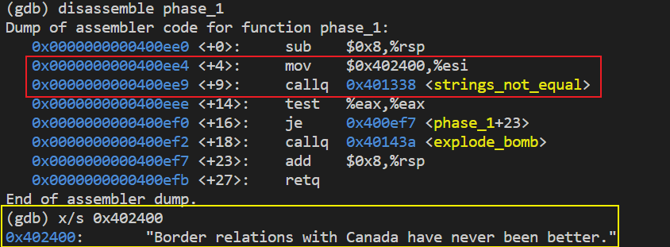
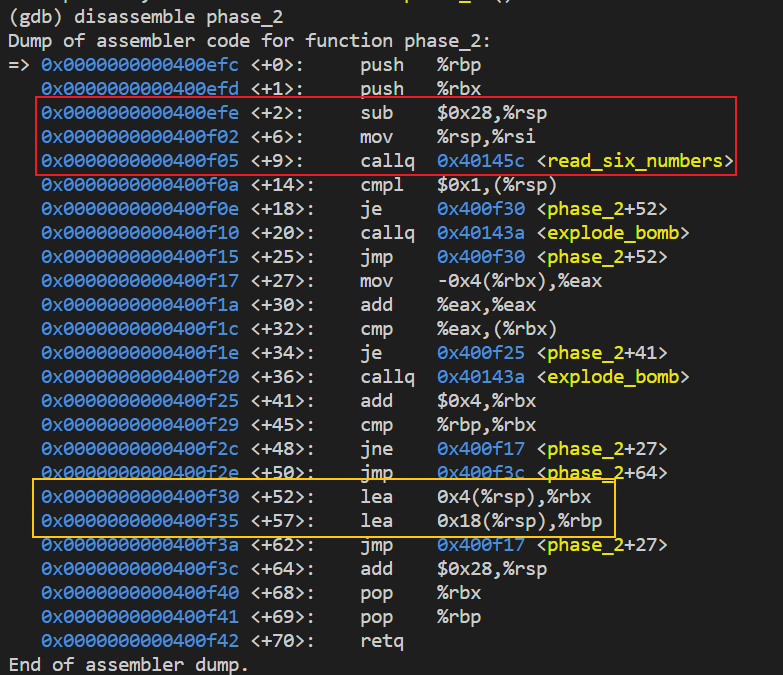
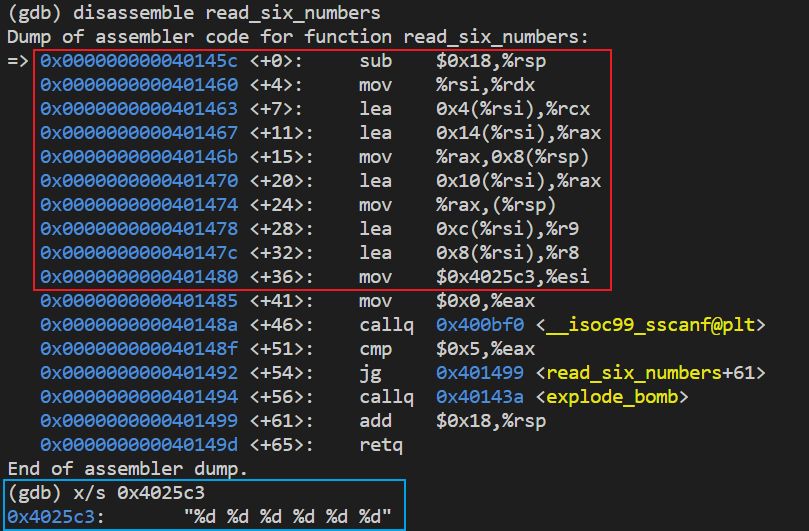
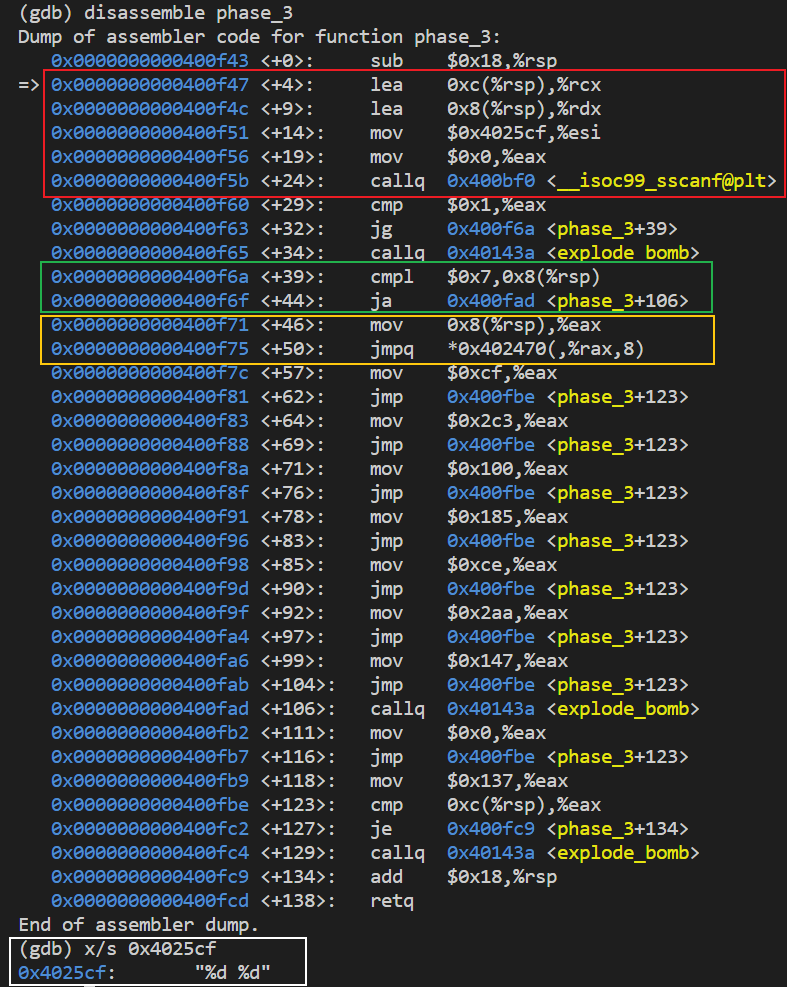
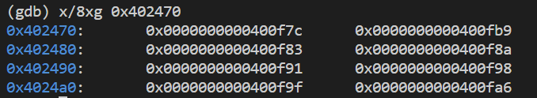
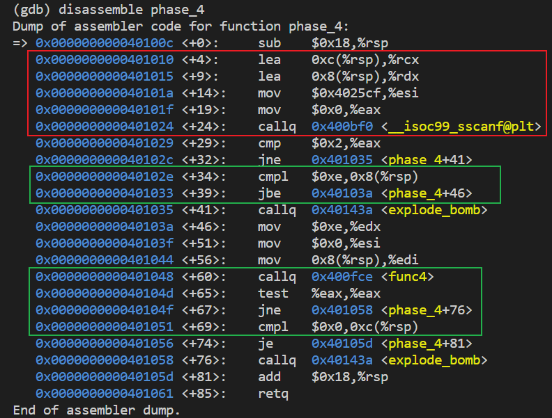
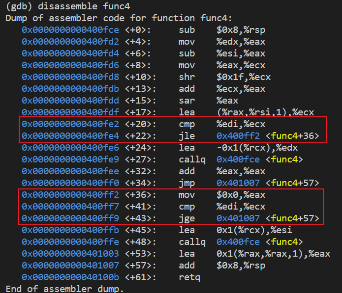

## 01_Data Lab

个别地方参考了别人的

因为限制了很多操作符，有些地方就很像脑筋急转弯一样，个人感觉没必要死磕

## 02_Bomb Lab

通过对可执行文件的反汇编来得到让程序正常结束的 6 行字符串，答案在 res.txt 中

### phase_1

phase_1(char* input):
- phase1 直接拿 input 和一个指定的字符串做比较，地址为 0x402400（红色部分）
- 黄色部分查看了 0x402400 处的字符串

### phase_2

phase_2(char* input):
- 红色部分在栈中开了一个 4x6字节 的空间（实际开了0x28），并把 栈指针%rsp 作为第二个参数传给了 read_six_numbers，第一个参数还是我们的 input字符串 的指针；read_six_numbers 会把读到的 6 个 int 存放到栈中
- 黄色部分指定了循环的结束位置：0x18(%rsp) 给到 %rbp，从 %rsp 开始正好是 24 字节
- 中间这部分的代码理一下，会发现 phase_2 要求的 6 个 int，第一个为 1，然后后面每一个都是前面的 2 倍

read_six_numbers(char* input, int* arr):
- 函数利用 sscanf 格式化 input 得到 6 个 int，并存放在 arr 中
- 红色部分是分配 sscanf 的参数，第一个参数(%rdi)还是 input；第二个参数(%rsi)是格式化字符串，地址是 0x4025c3，蓝色部分可以看到确实读了 6 个 int，剩下 6 个参数就是 int*，分别放在 (%rdx, rcx, r8, r9, %rsp, %rsp+4) 中

### phase_3

phase_3(char* input):
- 红色部分和前面的 phase 一样，这里是读了 2 个 int 变量，存放在了 0x8(%rsp) 和 0xc(%rsp)
- 绿色部分要求读入的第一个 int 是要 小于等于 7 的
- 黄色部分是关键，利用第一个 int 作为偏移选一个地址就行跳转，不同的第一个 int 对应唯一的第二个 int，这题一共有 8 种可选的答案：[(0, 207), (0, 311), (0, 707), (0, 256), (0, 389), (0, 206), (0, 682), (0, 327)]

0x402470 处存储的 8 个地址

### phase_4

phase_4(char* input):
- 红色部分和前面都一样，也是根据输入的 string 得到 2 个 int，假设为 x 和 y
- 第一个绿色部分要求 x <= 0xe
- 第二个绿色部分，观察后发现他要求 func4 的返回值为 0，且 y 也为 0，就可以正常 return

func4:
- 这函数涉及到递归，有点复杂，我是没有完全搞懂在干嘛
- 但是通过观察图中的 2 个红色框部分，一次比较 %ecx <= %edi (%edi 就是 x)，一次比较 %ecx >= %edi，并且中间把返回值设置为了 0，所以只需要让 x = 这时候的 %ecx 就不会进入递归并且返回 0；通过调试发现这时 %ecx 为 0，所以最后 x = 0, y = 0
- 这题可能有多个答案（我猜）

